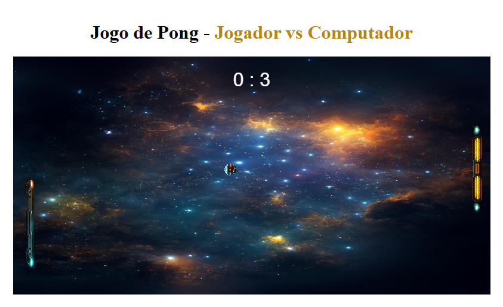

# Pong Game 🎮

Um jogo clássico de Pong recriado utilizando **JavaScript** e **p5.js**. Com responsividade e efeitos visuais, ele oferece uma experiência de nostalgia e diversão!

---

## 📋 Funcionalidades

- 🎯 **Jogador vs Computador**: Controle a raquete com o mouse e desafie a inteligência artificial.
- 🔊 **Áudio Dinâmico**: Sons de colisão e derrota para maior imersão.
- ⚡ **Aumenta de Velocidade Gradualmente**: A cada colisão, a bola fica mais rápida.
- 📱 **Responsividade**: Ajusta o tamanho das raquetes e o canvas para diferentes telas.
- 🔄 **Esmagamento**: A bola diminui de tamanho em colisões especiais.

---

## 🎮 Como Jogar

- **Mover a Raquete**: Utilize o mouse para controlar a raquete do jogador.
- **Objetivo**: Marque pontos ao fazer a bola passar pela raquete adversária.

---

## 🛠️ Tecnologias Utilizadas

- **JavaScript**: Lógica principal e controle de colisões.
- **p5.js**: Manipulação de canvas e renderização.
- **HTML/CSS**: Estrutura e responsividade.

---

[Link para o Projeto Pong](https://jogo-pong-tau.vercel.app/)

---

## 📷 Captura de Tela

